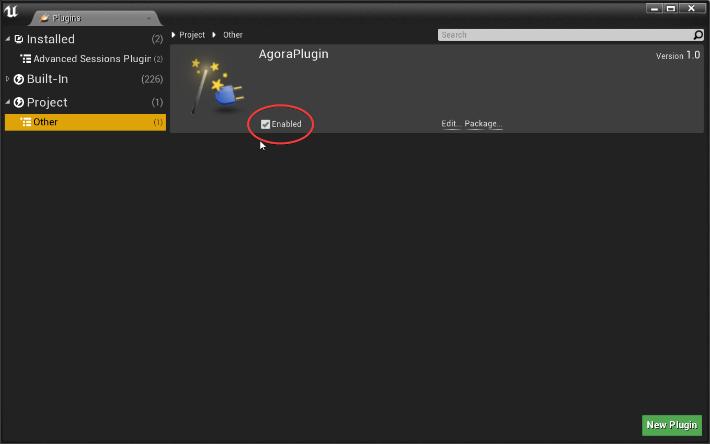
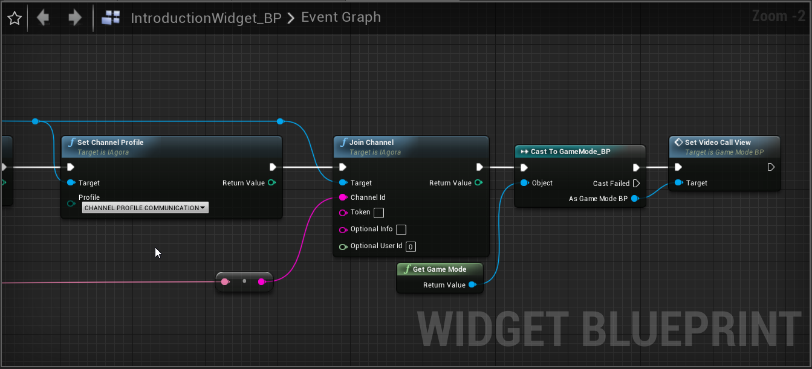
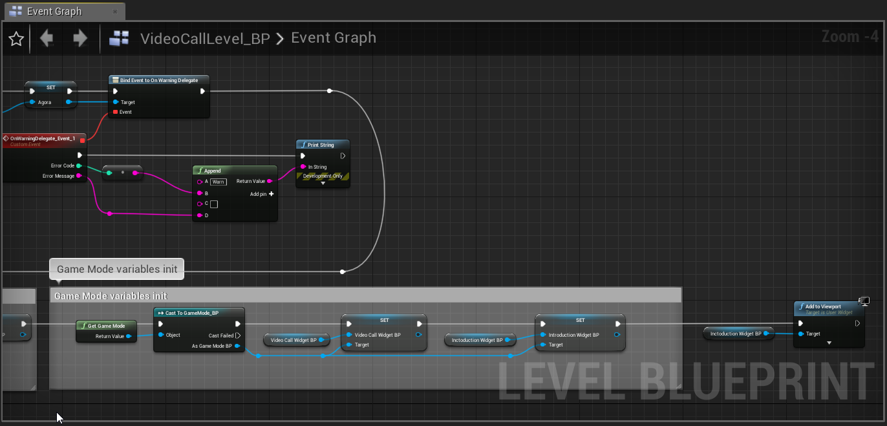
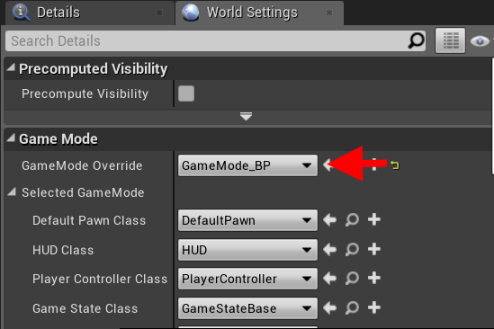

# Steps to Create the Sample

## Prerequisites

- Unreal Engine 4.23 or later
- Microsoft Visual Studio or Xcode( version required by Unreal Engine )
- A Windows device running Windows 7 or later or Mac device
- A valid Agora account. (<a href="https://dashboard.agora.io/?_ga=2.169392609.1139696370.1573117530-1815680581.1567671681" target="_blank">Sign up</a> for free)

#### Open the specified ports in Firewall Requirements if your network has a firewall.

<a href="https://docs.agora.io/en/Agora%20Platform/firewall?platform=All%20Platforms" target="_blank">Firewall Requirements</a>


## New Project

In this section, we will create an Unreal Engine project and integrate the plugin into the project.

- [Create a project](#create-a-project)
- [Installation](#installation)
- [Create a New Level](#create-a-new-level)

### Create a project

Now, let's build a project from scratch. Skip to **Installation** if a project already exists.

1. Open **Unreal Engine Editor** and click **New project**.
2. On the **New Project** panel, choose C++ as the project type, input the project name, choose the project location, and click **Create Project**.


3. Make sure to uncomment the PrivateDependencyModuleNames line in [your_project]/Source/[project_name]/[project_name].Build.cs file. Unreal comments this out by default, and causes a compile error if left commented out.

```cs
	// Uncomment if you are using Slate UI
	PrivateDependencyModuleNames.AddRange(new string[] { "UMG", "Slate", "SlateCore" });
```

### Installation

Follow these steps to integrate the Agora Plugin into your project.

1. Copy the plugin to [your_project]/Plugins
2. Add plugin dependency into [your_project]/Source/[project_name]/[project_name].Build.cs file, Private Dependencies section
`PrivateDependencyModuleNames.AddRange(new string[] { "AgoraPlugin", "AgoraBlueprintable" });`
3. Restart **Unreal Engine** (if it is running).
4. Go to **Edit->Plugins**. Find category **Project->Other** and make sure plugin is enabled.



### Create Game Instance

Go to the project **Content**, create new directory **Blueprints**.
Right click on the content, select **Blueprint Class**:


In **All Classes** section type "Game Instance" and select **Game Instance** class:


Name new Game Instance "AgoraGameInstance_BP":


Game Instance is initialized before other classes so we will create Agora here.

Go to AgoraGameInstance_BP blueprint (double click).
Right click on the blueprint workspace, type "Event Init" and select **Event Init**:


Drag and drop **Event Init** output pin, type "Construct" and select **Construct Object from Class** function:


From **Class** drop-down menu select **Agora**, drag and drop **Outer** input pin and select **Get reference to self**:


Drag and drop **Construct Agora** output **Return Value** pin and select **Promote to variable** option.
Name new variable "Agora", make it public by clicking an "Eye" symbol in front of variable name:


Drag and drop variable output node and in section "Agora" find method "Initialize":


Initialize Agora:


### Create Game Mode

Game Mode will be used to switch widgets.
Go to the directory **Blueprints** and create new Game Mode same as you did with Game Instance:


Name it **GameMode_BP**:


### Create Widgets

Go to the project **Content**, create new directory **Widgets_BP**.
Add two widgets in this directory:
right click on the directory content and choose **User Interface->Widget Blueprint**:


Name them **IntroductionWidget_BP** and **VideoCallWidget_BP**:


### Implement Game Mode

Go back to **GameMode_BP**, add two functions by clicking "+" in front of **Functions** section.
Name them "SetInctoductionView" and "SetVideoCallView".
Add two variables called "IntroductionWidget_BP" and "VideoCallWidget_BP", change types of these variables to
**Introduction Widget BP** and **Video Call Widget BP** respectively:


Implement functions as shown below:


### Implement Introduction Widget

Go to **InctoductionWidget_BP**, create widget interface as shown on the image:


Add initial variables to **EncriptionTypeComboBox**: 


Go to Graph view (Right top corner), find **Event Construct** and implement it as shown on the image:

 

Here **InctoductionWidget_BP** gets Agora object from **AgoraGameInstance_BP** and sets Agora sdk version to Text Block at the bottom of the widget.

Go back to Designer view, select **JoinButton** and find **Events** section, add **On Clicked** event:


Implement event as shown below: 




### Implement Video Call Widget

Find directory **Content/ButtonTextures** in demo application (you dont have to open the project, simply find this folder in filesystem).
All button textures are stored there.
In your project content create new directory called **ButtonTextures**, drag and drop all button images there to make them available in your project.

Go to **VideoCallLevel_BP**, create widget interface as shown on the image:


Open **Graph** view, add **isLocalAudioMuted**, **isLocalVideoMuted** boolean variables and **CurrentUserId** Integer64 varuable.
Add functions and implement them as shown below:


Go to **Event Graph** section and implement events as shown below:


### Create a New Level

Go to the project **Content**, create new directory **Levels** if it doesn't exist.
Right click on the directory content and choose new Level:
	


Then rename level to **VideoCallLevel_BP**: 


Select this level, click **Blueprints** icon on the top, go to **Open Level Blueprint** option:


Implement **Event Begin Play** as shown below:




### Modify Settings

- [Modify World Settings](#modify-world-settings)
- [Modify Project Settings](#modify-project-settings)

#### Modify World Settings

Now you need to set your custom GameMode class. 
Go to **Window->World Settings** and set **GameMode** to **GameMode_BP**:



#### Modify Project Settings

Go to **Edit->Project Settings**, select **Maps & Modes** Section.
Specify values as shown below:


### Run the game

