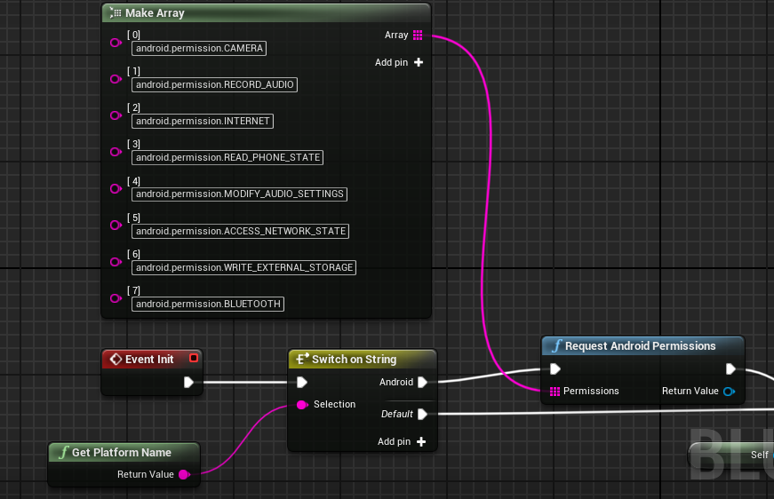

  

 

# AgoraVideoCall Sample App

The Agora Video Call is a demo app that will help you integrate Real Time Engagement directly into your Unreal Engine applications using the AgoraPlugin, that wraps Agora Video SDK.

With this sample app, you can:

- Join / leave channel
- Mute / unmute audio
- Enable / disable video
- Switch camera
- Setup resolution and frame rate 

Developed with Unreal Engine 4.23

There are two implementations of Agora Video Call demo application:
1) C++ based.
2) Blueprints based.

## Supported Platforms

Windows 64-bit

Mac

iOS

Android (7-10)

## Getting Started

**If you are starting with a blank project, start with C++ template

Agora plugin is implemented as separate module.

[Download the plugin from the Releases section of the Repo](https://github.com/AgoraIO-Community/Agora-Unreal-SDK-Blueprint/releases) and add the AgoraPlugin folder to the "Plugins" folder inside your Unreal project.

You can simply unzip and drop the entire AgoraPlugin folder inside of Plugins, and you're good to go!
The folder structure should like like <ProjectName>/Plugins/AgoraPlugin/

||
|

The iOS plugin is in a separate folder due to complications between Unreal and iOS building with Agora. This is a known issue and will be fixed in the next update.

## Building and Running the App
Open AgoraVideoCall.uproject with Unreal Editor 4.23-4.25.
Testing Agora Functionality: 
- PC: Play in editor or make a standalone build
- Mac: Make a standalone build
- iOS: Use Unreal's "Launch" feature
- Android: Make an .apk file and copy it to device

To package the project:
## Windows
File->Package Project->Windows->Windows(64-bit) then select a folder where you want to package and wait for result.

Next, copy the /Plugins/AgoraPlugin folder from your project into your built project folder: WindowsNoEditor/<project_name>/Plugins/AgoraPlugin

## Mac
File -> Package Project -> Mac

**Add the following permissions in the info.plist file for device access:
1. Right click <YourProjectName>.app file - select "Show Package Contents" 
2. Go to "Contents->Info.plist"
3. Click the plus next to "Information Property List" and add:

Privacy - Camera Usage Description

Privacy - Microphone Usage Description

**Add AgoraRtcKit.framework to your newly built project
1. Package the project from Unreal 
2. From inside the Plugins folder of the project, copy the file: **AgoraRtcKit.framework** from **Plugins/AgoraPlugin/Source/ThirdParty/Agora/Mac/Release** to 
3. Paste file into your newly built project folder **(Packaged project dir)/MacNoEditor/[project_name]/Contents/MacOS/**

|

## iOS Packaging
To package the project for iOS, you need to have a **Signing Certificate** and **Provisioning Profile** and add it to your project. 
I would *highly recommend* going to Project Settings > Platforms > iOS > Build > and check "Automatic Signing" - this saves a lot of headache.

If you don't have one: follow the instructions from UE4 documentation: [iOS Provisioning](https://docs.unrealengine.com/en-US/Platforms/Mobile/iOS/Provisioning/index.html)
Go to the **Edit->Project Settings->Platforms: iOS**, then select the certificate and provisioning profile you created. 

If you don't see one of them in the table, click  **Import Certificate** or **Import Provision**, chose the right file in Finder and click **Open**. 

Then enter a Bundle Identifier: it must be the Bundle Id you used during certificate creation.

### iOS Testing
To test your Agora project on your iOS device:
1. Connect your phone to your computer via USB
2. Make sure your signing certificates are all up to date and working
3. In the Unreal "Toolbar" (Save, Compile, Source Control, etc.) click the "Launch" button (to the right of Play) with your device selected in the dropdown

## iOS permissions
In the iOS you also need the following permissions:

Privacy - Camera Usage Description

Privacy - Microphone Usage Description

To add them in the info.plist go to the **Edit->Project Settings->Platforms: iOS** and enter the following line to Additional Plist Data: 
`<key>NSCameraUsageDescription</key><string>AgoraVideoCall</string> <key>NSMicrophoneUsageDescription</key><string>AgoraVideoCall</string>`

Now you are ready to package your project for iOS or launch it on iOS device.

## Android Packaging
Using Blueprints, you have to request Android Permissions like so: 

In your Unreal Project Settings, include these permissions at Project Settings > Platforms > Android > Advanced APK Packaging > Extra Permissions

## Plugin Dependencies

1. Copy the plugin to [your_project]/Plugins
2. Add plugin dependency into [your_project]/Source/[project_name]/[project_name].Build.cs, Private Dependencies section

`PrivateDependencyModuleNames.AddRange(new string[] { "AgoraPlugin", "AgoraBlueprintable" });`

If the version of your Unreal Editor is 4.24 or higher add the following into [your_project]/Source/[project_name]Editor.Target.cs

`DefaultBuildSettings = BuildSettingsVersion.V2;`

3. Open Unreal Project, go to **Edit->Plugins**. Find category **Project->Other** and make sure plugin is enabled.

## Connect With Us

- You can find full API document at [Document Center](https://docs.agora.io/en/)
